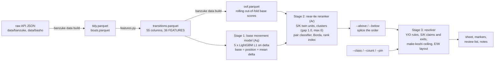
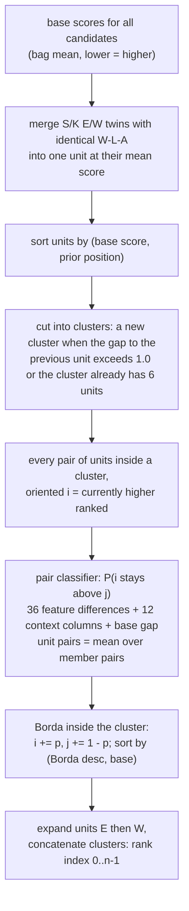
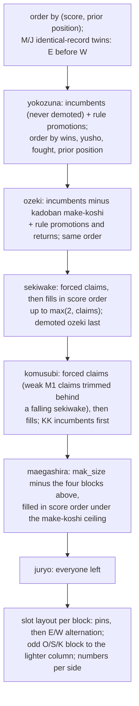

# How the default model works

Six times a year a sumo tournament ends and, a few weeks later, the Sumo
Association publishes the next banzuke: the ranking sheet that says who
moved up, who moved down, who was promoted to the titled ranks at the top
and who fell to the second division. The committee that writes it works
from the tournament's results and from long habit rather than from a
published formula. This program predicts the sheet from the results
alone.

It does so in three steps. First, having seen every sheet since 1959 and
how each man's record moved him, it estimates how far up or down each
wrestler goes this time: a 10-5 from the middle of the division climbs
five or six ranks, a 6-9 drops about three, a full absence drops a long
way.
Second, wherever two or three men are estimated to land in nearly the
same spot, a second component that has studied exactly those close calls
says which of them the committee tends to put first. Third, that ordering
is turned into an actual sheet by applying the conventions the committee
has never broken: a yokozuna is never demoted, an ozeki with two losing
records in a row is, a losing record never earns a promotion, the east
column fills before the west, and so on. The sheet is printed with marks
on the spots the program is unsure of, and you can overrule any of it.

The rest of this document describes that pipeline, the default model
`Ar` behind `banzuke predict`, stage by stage as it runs.
`docs/EXPERIMENTS.md` records why each piece is built the way it is and
what else has been tried. Precedent counts quoted for the committee's
conventions are from the data through 202609 (2004 onward unless
stated); `banzuke conventions` recounts them from the
current data, and section 10 says how the rest of the document is kept
in step with the code.

Vocabulary used throughout:

- **basho**: one tournament, identified as `YYYYMM` (six a year: 01, 03,
  05, 07, 09, 11). **banzuke**: the ranking sheet published before it.
  The model predicts the banzuke of basho N+1 from the results of basho N;
  a (rikishi, basho N) row together with its N+1 label is a
  **transition**.
- **class**: Y (yokozuna), O (ozeki), S (sekiwake), K (komusubi), M
  (maegashira), J (juryo), stored as ordinals 0-5, lower = higher.
  Y/O/S/K are called sanyaku here. A **cell** is a (class, number, side)
  label such as `M3W`.
- **position**: a cell's joint index on the sheet, 0 = Y1E, counting east
  then west through every maegashira and juryo cell. One position step is
  one cell, half a rank (M3E to M3W); every distance, error and score in
  the project is in these units. `delta` = position next basho minus
  position now, so negative means a rise.
- **score**: a model's output per candidate, lower = ranked higher. The
  resolver sorts by it.
- **kachi-koshi** (KK): 8+ wins; **make-koshi** (MK): fewer. **kadoban**:
  an ozeki who must reach 8 wins or lose the rank.

## 1. Pipeline at a glance



One run: the raw sumo-api responses are parsed into one row per rikishi
per basho and enriched with history features and next-banzuke labels
(section 2); five L1 gradient-boosted regressors predict each candidate's
movement and are averaged into a base score (3); where base scores are
nearly tied, a pair classifier that learned how the committee breaks such
ties reorders the cluster (4); the resolver turns the ordering into
labelled cells by applying the conventions the committee does not break
(5); overrides can constrain any of this (6); markers, a review list and
notes say where the sheet is shaky (7). Section 8 walks through
`banzuke predict` in call order, 9 covers how the whole thing is scored, and
the appendix lists the other models in the tree.

Everything after the data build is retrained on every invocation (the
bag's members fit concurrently, `--threads`); nothing is persisted. The
one training input that comes from a model fit, the reranker's
out-of-fold table (4.4), is part of the data build and committed with it.

## 2. The dataset

### 2.1 Build (`banzuke/build.py`, `banzuke/features.py`)

`banzuke data update` fetches `data/banzuke/{basho}_{Makuuchi,Juryo}.json`
and `data/basho/{basho}.json` from sumo-api.com (`banzuke.fetch`), then
`banzuke.build` writes
four Parquet files under `data/processed/` (all committed):

| file | one row per | contents |
|---|---|---|
| `tidy.parquet` | rikishi x basho on the makuuchi or juryo banzuke | rank, record, prizes, division sizes, `position` |
| `bouts.parquet` | competitive bout | `(basho, winner, loser)`, read off each man's record array; fusen excluded |
| `transitions.parquet` | the same rows as tidy | tidy + history features + next-banzuke labels; what the models and the resolver read (`bouts.parquet` is an input of the build only) |
| `oof.parquet` | labelled row from the 61st basho on | `(basho, rikishi_id, oof)`: the default base stage's rolling out-of-fold score (4.4), the reranker's training input; the key it was built under is in the file's pandas attrs |

Through 202609 the data holds 400 banzuke (195911-202609), 26,878 rows,
25,316 of them with a next-banzuke label, and 191,796 bouts.

Details of the build that matter downstream:

- `position` is assigned by sorting each basho's rows by (class, number,
  side) and counting from 0; makuuchi and juryo form one sequence.
- `yusho` comes from the basho metadata (division champion). `junyusho`
  is derived: the best record among the division's non-winners (several
  men can share it). `sansho` counts special prizes.
- `CORRECTIONS` patches raw records whose scheduled bout has an empty
  result (a single case in the data, 202507 juryo day 15); any other blank
  scheduled bout fails the build rather than silently shortening a record.
- Labels join each man's row at basho N to his row at the next basho in
  the data. `dropped` marks men known to be absent from the next banzuke
  (retired, fell to makushita); they are left out of the candidates when
  the next banzuke has already been fetched.

### 2.2 Column reference

`transitions.parquet` has 55 columns in five roles. The 36 model inputs
are `features.FEATURES`, listed here in their declared order (the order
LightGBM sees them). Lagged columns follow one contiguity rule: they are
NaN unless the man was on the makuuchi/juryo banzuke at the immediately
preceding basho (both preceding basho for two-back lags), so a return from
makushita or a debut carries no history.

<!-- COLUMNS:begin -->

**Identity (3)**

| column | definition |
|---|---|
| `basho` | tournament id, `YYYYMM` |
| `rikishi_id` | sumo-api rikishi id (stable across shikona changes) |
| `shikona` | ring name at that basho, romanised |

**Model features: current rank (5)**

<!-- FEATURES:begin -->

| column | definition |
|---|---|
| `rank_class` | 0 Y, 1 O, 2 S, 3 K, 4 M, 5 J |
| `rank_number` | number within the class (M3W gives 3) |
| `side` | 0 East, 1 West |
| `position` | joint index on the sheet, 0 = Y1E, through the last juryo cell |
| `division` | 0 makuuchi, 1 juryo |

**Model features: this basho's result (6)**

| column | definition |
|---|---|
| `wins` | final record; `wins + losses + absences` is 15 except for no-shows with an empty record and mid-basho retirements |
| `losses` | |
| `absences` | days absent (kyujo) |
| `fusen_l` | forfeit losses (bouts recorded as "fusen loss") |
| `kk` | kachi-koshi: `wins >= 8` |
| `win8` | `wins - 8`, the committee's zero point |

**Model features: prizes (4)**

| column | definition |
|---|---|
| `yusho` | won the division (makuuchi or juryo) |
| `junyusho` | best record among the division's non-winners with `wins > 0`; several men can share it |
| `sansho` | special prizes this basho (0-3) |
| `sansho_career` | cumulative special prizes through this basho |

**Model features: recent form (5, lagged)**

| column | definition |
|---|---|
| `w1` | wins one basho ago |
| `w2` | wins two basho ago |
| `pos1` | position one basho ago |
| `roll3` | `wins + w1 + w2` (NaN when either lag is) |
| `traj3` | position two basho ago minus position now (positive = has been climbing) |

**Model features: career state (4)**

| column | definition |
|---|---|
| `kk_streak` | consecutive kachi-koshi basho including this one (0 after a make-koshi; restarts after a gap in appearances) |
| `sanyaku_tenure` | consecutive basho at komusubi or above including this one |
| `career_high` | best cell ever held, as `class * 100 + number` (lower = better) |
| `n_basho` | makuuchi/juryo banzuke appearances in the data so far |

**Model features: yokozuna and ozeki status (4)**

| column | definition |
|---|---|
| `kadoban` | ozeki now, ozeki last basho, make-koshi last basho; survives an exempted make-koshi (Mitakeumi 202209) so that a further one demotes |
| `demoted_ozeki` | sekiwake now, ozeki last basho |
| `ozeki_run3` | `roll3` when this and both previous basho were at S/K, else NaN |
| `sanyaku3` | how many of the last three basho (this one included) were at komusubi or above |

**Model features: lagged prizes (2)**

| column | definition |
|---|---|
| `yusho1` | yusho one basho ago |
| `junyusho1` | jun-yusho one basho ago |

**Model features: era and field (5)**

| column | definition |
|---|---|
| `year` | `basho // 100` |
| `kosho` | 1 for 197201-200311, the kosho seido era (an injury absence could freeze the rank) |
| `mak_size` | makuuchi size this basho (nominally 42 since 2004; 40-41 when expulsions or post-meeting retirements left gaps) |
| `jur_size` | juryo size this basho (nominally 28 since 2004) |
| `boundary_dist` | `position - mak_size`: signed distance to the makuuchi/juryo line, negative inside makuuchi |

**Model features: exemptions (1)**

| column | definition |
|---|---|
| `rank_protected` | 1 when a full absence (0 wins, 8+ absences, at sekiwake or below) was not counted against the man: kosho granted in 1972-2003 (read off the frozen rank, `delta <= 3`; the decision was public before the banzuke) or a modern exemption listed in `features.PROTECTED` (the last kosho cases of 200401, the 2020-2022 COVID withdrawals). `banzuke predict --protected Name` sets it live |

<!-- FEATURES:end -->

**Resolver inputs, not model features (4, lagged)**

| column | definition |
|---|---|
| `class1` | rank class one basho ago |
| `class2` | rank class two basho ago |
| `num1` | rank number one basho ago |
| `num2` | rank number two basho ago |

Read by the yokozuna and ozeki promotion rules (5.1, rules 4 and 6):
"fought as ozeki", "one of the three basho at M1-M3".

**Labels (8)**

| column | definition |
|---|---|
| `next_basho` | the next basho in the data (NaN for the latest) |
| `position_next` | the same man's position on that banzuke; NaN when he is not on it |
| `division_next` | his division there |
| `class_next` | his class there |
| `number_next` | his rank number there |
| `side_next` | his side there |
| `dropped` | next banzuke known and he is not on it (retired, fell to makushita) |
| `delta` | `position_next - position`: the training target, negative = rise |

**Computed, excluded from the models (4)**

| column | definition |
|---|---|
| `opp_pos_mean` | mean position of the opponents actually fought |
| `n_joi_opp` | opponents from the top 16 positions |
| `wins_vs_joi` | wins over them |
| `kinboshi` | yokozuna beaten while ranked maegashira |

Realised strength of schedule from the bout records. Not model inputs
(joi membership is implied by position, which the models already have);
kept in the dataset so `--set extra=...` can measure them.

<!-- COLUMNS:end -->

### 2.3 Conventions

- Every feature at basho N uses only what was known when the N+1 banzuke
  was made: the results of N included, nothing later. The one exception
  is `rank_protected` in the kosho era, inferred from the frozen rank
  because the kosho decision itself was public before the banzuke.
- Ordinals everywhere: class 0-5, side 0/1, lower = higher. Scores,
  positions and deltas share the direction: smaller is higher on the
  sheet.
- NaN is a value, not an error: LightGBM routes missing lags natively,
  and the resolver treats a NaN run as "no run".
- The training set is every labelled transition since 1959, juryo rows
  included (the boundary is learned by the same model). `--train-start`
  restricts it to newer transitions; full history is the default because
  the era columns already let the trees specialise to the modern regime.

## 3. Stage 1: base movement model (`Aq`)

`models.GBMMedian`, the stage `Ar` inherits. Five `LGBMRegressor`s with
`objective="regression_l1"` (median regression) are fitted on
`train[FEATURES]` against `delta`, one per `random_state` 0-4. For each
candidate the five predicted movements are averaged and added to his
current position:

    base_score = position + mean_k(delta_k)

the model's predicted next position in cells, before any structure is
applied; lower = ranked higher. L1 rather than L2 because the committee's
big moves (a 13-2 from M12, a full kyujo) are real and L2 shrinks them
toward the crowd; the five-seed bag damps the seed-to-seed noise of a
single fit, which the resolver would otherwise turn into block shifts.

`BASE_PARAMS` (`--set base.KEY=VALUE` to override):

| parameter | value | note |
|---|---:|---|
| `n_estimators` | 300 | |
| `learning_rate` | 0.05 | |
| `num_leaves` | 63 | |
| `min_child_samples` | 30 | |
| `subsample`, `subsample_freq` | 0.9, 1 | row bagging every round |
| `colsample_bytree` | 0.9 | |
| `force_row_wise` | true | fixes the histogram layout LightGBM would otherwise pick by timing |
| `n_jobs` | 1 | one thread per fit; parallelism is across backtest targets, OOF basho and, in `banzuke predict`, the bag's seeds (`--threads`) |

The base stage scores men independently: everything it knows is in its
own row (2.2). The field, who else is competing for the same cells,
enters through the reranker's context columns and the resolver.

## 4. Stage 2: near-tie reranker (`Ar`)

`models.GBMRerank`. The base model orders every candidate, but most of its
misses are E/W flips and off-by-one placements between men whose base
scores lie within a cell of each other. The committee resolves such ties
by habit (wins first, then prior order, with regularities a per-man
regression cannot see). `Ar` keeps the base order between clusters and
lets a pair classifier reorder inside them.



### 4.1 Twin units

East and West of one sekiwake or komusubi rank number with identical
W-L-A records (`twin_units`, scope `"sk"`) are one unit: clustered at
their mean base score, compared with a rival by the mean of the two
members' pair probabilities, and written back out E then W. The committee
has never split such a pair (26/26 since 2004, 92/98 since 1959), while
Borda on its own would: the twins' mutual comparison is certain, so any
rival the classifier is honestly unsure about lands between them.
Maegashira and juryo twins are not units (the committee does split those
about a third of the time); their E-before-W order is protected by the
resolver instead (5.1, rule 2).

### 4.2 Clusters

Units are sorted by (base score, prior position) and cut into clusters: a
new cluster starts when a unit's base score is more than `gap = 1.0`
above the previous unit's, or the current cluster already holds
`cluster_max = 6` units. Men inside a cluster may be reordered; the order
between clusters is the base order. About 77 pairs per basho go to the
classifier.

### 4.3 Pair classifier (`_PairStage`)

Five `LGBMClassifier`s (`PAIR_PARAMS`, which is `BASE_PARAMS` with 150
rounds), one per seed, probabilities averaged. Each example is an ordered
pair (i, j) of one basho's rows with i the currently higher ranked; the
label is "i is still above j on the next banzuke"
(`position_next[i] < position_next[j]`).

Training pairs, per training basho:

1. every pair within `pair_window = 6` rows of each other in the current
   order (the committee's local decisions; about 64% positive), and
2. with `near_ties = true`, every pair whose rolling out-of-fold base
   scores (4.4) differ by at most `oof_gap = 2.0`: the pairs the reranker
   is actually asked about at inference, more than half of which lie
   outside the window.

The 49-column feature vector of a pair:

| block | columns | content |
|---|---:|---|
| differences | 36 | `FEATURES[i] - FEATURES[j]` (era and size columns difference to zero, hence the next block) |
| shared context | 4 | `year`, `kosho`, `mak_size`, `jur_size` of the basho |
| pair location | 4 | means of `position`, `rank_number`, `wins`, `boundary_dist` |
| endpoints | 4 | `rank_class` and `division` of i, then of j |
| base gap | 1 | `base[i] - base[j]`: the OOF gap in training, the live bag's gap at inference |

### 4.4 Rolling out-of-fold base scores (`oof_base_scores`)

The pair stage's gap feature must have the same distribution in training
as at inference, and an in-sample base score is far too accurate. So for
every labelled basho b after the first 60 (`OOF_MIN_HISTORY`; every
basho from 196911 on) the base stage is fitted on the transitions
labelled by b (`next_basho <= b`) and scores the rows of b: exactly the
base prediction the backtest would have made for target next(b), so no
row is scored by a model that saw its label. The table is identified by
`oof_key`: the base configuration (objective, `n_seeds`, `base.*`,
`extra`, `--train-start`), `BASE_PARAMS`, the base-stage source and a
content hash of the labelled data. The default model's
table is built by `banzuke data build` (one process per `--threads`;
`--skip-oof` to leave it alone) and committed as
`data/processed/oof.parquet` with its key in the frame's attrs, so a
clone needs no one-off computation. A command that finds the key stale
(a data update or a base-stage change without a rebuild) says so and
rebuilds the file in place; `tests/test_banzuke.py` fails on a stale
file so the rebuild lands in the same commit as the change. Any other
base configuration (`--seeds`, `--set base.*`, `--train-start`) computes
its own table under `cache/oof/<key>.parquet`; pair-stage options share
the default one. `GBMRerank.prepare()` supplies it before `fit()`
(`banzuke/oof.py`).

### 4.5 Aggregation and output

Inside each cluster every pair of units is scored (oriented by current
position, as in training) and summed Borda-style: unit a receives
`P(a above b)`, unit b receives `1 - P`. Units are sorted by (Borda
descending, base score), expanded into their members (E before W), and
the clusters are concatenated. `Ar.score()` therefore returns a rank
index 0..n-1, a permutation of the candidates rather than a continuous
score; `base_score()` (the stage-1 position) stays available and is what
the confidence signals measure gaps on (7).

### 4.6 Options

`--set KEY=VALUE` on `banzuke predict` and `banzuke backtest`:

| option | default | meaning |
|---|---|---|
| `n_seeds` | 5 | bag size; seeds `5*seed .. 5*seed+4`, so bag replicates (seed 0, seed 1) are disjoint |
| `pair_window` | 6 | training pairs within this many rows of the current order |
| `near_ties` | true | add OOF near-tie pairs to the training set |
| `oof_gap` | 2.0 | near-tie threshold, in cells |
| `context` | true | the 12 context columns of 4.3 |
| `gap` | 1.0 | cluster break, in cells |
| `cluster_max` | 6 | largest cluster the reranker may reorder |
| `twin_unit` | `sk` | identical-record S/K E/W pairs are one unit; `all` adds M/J, empty disables |
| `extra` | none | dataset columns appended to `FEATURES` in both stages, e.g. `--set extra=kinboshi`; the no-code path for measuring a candidate input |
| `base.*`, `pair.*` | `BASE_PARAMS`, `PAIR_PARAMS` | LightGBM parameters of each stage |

## 5. Stage 3: resolver (`banzuke/resolver.py`)

The resolver turns the ordering into cells. Rule knowledge belongs in the
model's features; this stage applies only the structure the committee
treats as near-inviolable, each rule an empirical regularity read off
history with its count recorded. Membership of the classes is settled
top-down, then each block is laid out.



### 5.1 Rules, in application order

1. **Start from the model's order.** Candidates are sorted by (score,
   prior position), ties going to the man ranked higher today.
   (`resolve`)

2. **Identical-record maegashira and juryo twins keep East above West.**
   If the model ranks the West man of a pair with one rank number and the
   same W-L-A above the East man, the two exchange places in the order;
   nobody else moves. The committee has never swapped such a pair:
   0/437 since 2004, 0/1514 since 1959. (`keep_twin_order`)

3. **A yokozuna is never demoted.** Every yokozuna incumbent is a
   yokozuna on the next sheet, whatever his record (0 exceptions in 864
   yokozuna rows since 1959).

4. **Yokozuna promotion.** An ozeki who won this yusho after a yusho or a
   12+ win jun-yusho at the previous basho, that earlier result fought as
   ozeki: 6/8 promoted when it was, 0/3 when it was fought at sekiwake.
   The promotion is listed under `notes:` with the results behind it.
   (`rule_masks["y_promo"]`)

5. **A kadoban ozeki with make-koshi leaves the rank.** `kadoban` and
   fewer than 8 wins: he is no longer ozeki, holds a forced sekiwake claim
   (rule 9) and is placed at the bottom of the sekiwake block (rule 14).
   17/18; the exception is a COVID-era exemption (Mitakeumi, 202207).
   Every other ozeki keeps the rank (431/431).
   (`forced_claims["kadoban_out"]`)

6. **Ozeki promotion.** A sekiwake or komusubi with 10+ wins and 33 wins
   over the last three basho (32 if he won this yusho), all three at S/K:
   the classic rule, 16/19. Or 12+ wins now and a 33-win run where
   exactly one of the two earlier basho was at M1-M3 and the other in
   sanyaku: 4/4, while runs with two maegashira basho were declined 0/3.
   (`rule_masks["o_run"]`, `["o_run_m"]`)

7. **A demoted ozeki with 10+ wins returns.** Sekiwake now, ozeki last
   basho, 10 wins or more (5/5). (`rule_masks["o_return"]`)

8. **Yokozuna who stay and ozeki who stay are ordered by wins, then the
   yusho, then having fought, then prior position**: 139/139 Y pairs and
   554/554 O pairs since 2004. A newly promoted or returning yokozuna or
   ozeki takes the lowest slot of his class (7/7 Y, 28/28 O).
   (`rule_class`, `yo_key`)

9. **Forced sekiwake claims.** A falling kadoban ozeki (rule 5), a
   kachi-koshi sekiwake incumbent (186/186 stay in sanyaku), and a
   komusubi with 11+ wins (21/21 promoted) are sekiwake.
   (`forced_claims["s"]`)

10. **Forced komusubi claims.** A kachi-koshi komusubi incumbent
    (113/113 stay); the maegashira claims M1 with 8+, M2 11+, M3 10+, M4
    12+, M5 13+ wins (honoured 86/94 for M1 and 39/42 for the rest); and
    a sekiwake with exactly 7 wins when at least two other sekiwake
    candidates exist (kachi-koshi S/K incumbents, maegashira claimants, a
    demoted ozeki): 29/29; with fewer candidates the model decides (5.2).
    (`forced_claims["k"]`, `rule_masks["k_from_s"]`)

11. **Make-koshi exits.** These are excluded from the open sanyaku slots
    of rule 13: a sekiwake with 6 or fewer wins (69/70), the 7-win
    sekiwake of rule 10 (he leaves the sekiwake block for his komusubi
    claim), a komusubi with 6 or fewer wins (131/132), a komusubi with 7
    wins anywhere but K1E (24/24). A K1E with 7 wins is left to the model
    (5/12 kept). (`rule_masks["exit"]`)

12. **At least two sekiwake and two komusubi; a block grows to the number
    of forced claims.** Every banzuke since 1959 has had at least two of
    each. One exception to growth: when a falling 7-win sekiwake holds a
    komusubi claim, M1 claims with 8-9 wins do not create a third slot
    for him; the lowest-scored of them go back to maegashira while the
    block exceeds two (`rule_masks["m1_weak"]`). `--count S=3` sets a
    block's size by hand.

13. **Open slots are filled in score order under the make-koshi ceiling.**
    After the forced members, the highest-scored candidates who are not
    exiting (rule 11) and whom rule 16 allows fill the block; feasibility
    is checked for the block as a whole, pins and ceilings included.
    Because a make-koshi man never lands above his current cell, a
    make-koshi maegashira cannot fill a sanyaku slot: this is what "no
    promotion after make-koshi" means for S/K/M.

14. **Within a block the model's order holds**, with two exceptions: a
    demoted ozeki is the bottom sekiwake (0/30 above another sekiwake,
    never S1E), and komusubi newcomers rank below kachi-koshi komusubi
    incumbents (47/49). (`fill_class`)

15. **Maegashira count and the juryo boundary.** The maegashira block has
    `mak_size - (Y + O + S + K)` slots, `mak_size` defaulting to the
    previous banzuke's (`--mak-size` to say otherwise). Remaining men are
    taken in score order under the ceiling; everyone left is juryo. The
    next sheet's actual size is not known at forecast time.

16. **Make-koshi ceiling.** A sekiwake, komusubi or maegashira without
    kachi-koshi never lands above his current (class, number, side) cell;
    West to East of the same number counts as above. Applied when
    deciding membership (rule 13) and again when handing out slots: an
    ineligible man is skipped and takes the next slot he may have. Juryo
    men are not bounded. 2 exceptions in 2,705 make-koshi S/K/M rows
    since 2004, both maegashira on the 201107 banzuke.

17. **East/West layout.** Within a block, slots alternate E, W, E, W with
    numbers counted per side (E, W, W gives 1E, 1W, 2W). An odd-sized
    ozeki, sekiwake or komusubi block sends its last slot to the lighter
    column counting the blocks above it (one yokozuna and three ozeki lay
    out Y1E / O1E O1W O2W); the yokozuna and maegashira blocks alternate
    strictly. Since 2004 the O/S/K layout held on 134, 135 and 135 of 135
    banzuke and the maegashira alternation on 132 (the exceptions are
    mid-sheet gaps left by post-meeting retirements and expulsions).
    Pinned cells are reserved first; the remaining slots are filled in
    precedence order by the first eligible member. (`block_slots`)

### 5.2 What the resolver leaves to the model

- A K1E with 7-8: stays (K1E or K1W) or drops (kept 5/12).
- A 7-8 sekiwake with fewer than two other sekiwake candidates: S, K or
  M (4 went to komusubi; Goeido stayed S1W in 201207 and 201305).
- Who fills an open sekiwake or komusubi slot when the forced claims are
  fewer than two: the highest-scored kachi-koshi man, subject to the
  ceiling (an M2 9-6 against an M4 10-5, say).
- Whether a slot is created for a man the claim table does not know (an
  M2 10-5 was given one 12/16): the resolver creates slots only for
  forced claims, so the answer is always no unless the reviewer says
  `--count K=3` or `--class Name=K`.
- Yokozuna and ozeki promotions the rules do not cover, or cover on thin
  precedent: a jun-yusho after a yusho is not a rule (promoted 1/2); a
  yusho after a 12-3 jun-yusho fires rule 4 but was honoured only 1/3
  since 2004. `--class Name=Y` to promote, `--class Name=O` to keep him
  ozeki.
- The order within the sekiwake and komusubi blocks (apart from rule 14),
  all of the maegashira order, and the juryo boundary.
- Inputs it cannot know: retirements (`--retired`), the next sheet's
  size (`--mak-size`), a JSA exemption for a full absence
  (`--protected`).

### 5.3 The convention audit

`banzuke conventions` recounts every rule above, plus the
regularities the resolver does not enforce (the 17+ cell drop of an
unexempted full kyujo, marked "watch", and the S/K twin adjacency that
`twin_unit` assumes, marked "Ar twin_unit"), over all history, 2004+, the
last 60 and the last 30 basho, as violations/cases with the last
violating basho. `!`
flags a rule that was clean since 2004 and is violated inside the last
30; `~` a rule whose recent violation rate is above its 2004+ rate.
`banzuke analyze` ends with the same table. A rule can only be wrong going
forward, never silently: the first exception shows up in the table after
the next data update.

## 6. Overrides (`banzuke/overrides.py`)

The grammar is in the README. How they enter the pipeline:

- **Relative** (`--above "A > B"`, `--below "A < B"`, chains `A > B > C`,
  groups `A > B,C`) are applied to the ordering before the resolver
  (`splice`): only the first-named man moves, the minimal distance that
  clears his target; sequentially, so a later override sees the effect
  of an earlier one; no-op when already satisfied. They are spliced into
  the bag's order and into every single-seed order alike.
- **Structural** (`--class X=O`, `--count S=3`, `--pin X=M2E`) are handed
  to `resolve`. A class assertion puts the man in that class whatever the
  rules say (at the bottom of a Y/O block, in score order elsewhere); a
  count fixes a block's size (at least the number of forced and asserted
  members, else an error); a pin reserves an exact cell and implies the
  class assertion.
- **Precedence**: overrides outrank every convention in 5.1. Each
  convention broken is reported under `warnings:` (demoting a yokozuna or
  ozeki, retaining a kadoban make-koshi ozeki, cancelling a rule
  promotion, overriding a forced claim, keeping an exiting make-koshi man
  in sanyaku, fewer than two sekiwake or komusubi, promoting a make-koshi
  man above his cell).
- A relative override that the ordering satisfies can still be inverted
  by a convention (a forced claim lifts B back over A); the `overrides:`
  section then reports it as VIOLATED rather than silently breaking the
  convention.
- Infeasible combinations (a pin on a slot the block does not have, a
  count below the forced members, nobody eligible for a slot without a
  make-koshi promotion) are errors, not silent adjustments; in
  `--interactive` the override is rejected and the previous state kept.
- Scores are computed once; nothing is re-inferred. The sheet shifts
  structurally around the override, and every man whose cell differs
  from the no-override sheet is marked with that cell (`<-M3E`).

## 7. Confidence markers, review list and notes

`banzuke.confidence` is pure functions over the resolved sheet, the base
scores, the final (post-splice) order and the single-seed sheets.

**Signals per man** (`signals`). A boundary is a consecutive pair in the
resolved order; it is *decided by the model* when the final order agrees
with the resolved order, both men are outside Y/O (base scores there are
compressed and meaningless), and neither was named in an override. For
each man:

| signal | definition |
|---|---|
| `gap` | smallest base-score gap across his decided boundaries |
| `tight` | some decided boundary has `gap < 0.25` (`TIGHT_GAP`) |
| `inverted` | some decided boundary has a negative gap: the reranker reversed the base order |
| `spread` | max minus min of his position across the single-seed sheets (0 with one seed) |
| `big_move` | a makuuchi incumbent moving 8+ cells (`BIG_MOVE`), or a juryo man landing 8+ cells above the last makuuchi cell; only for men predicted in makuuchi |

Marker: `n_signals = tight + (spread >= 1) + (spread >= 2)`; 1 gives
`?`, 2 or more `??`; `~` is appended for a big move; `!` is set by the
structural items below. A boundary touching a man named in an override is
never "decided by the model", so overrides remove `tight` and `inverted`
from the men they name (the seed-spread and big-move signals stay).

**Review items** (`review`): one per run of consecutive boundaries that
are tight or flip across seeds, skipped when the run starts in juryo,
sorted least confident first (most `??` members, then smallest gap). Each
names the members in order, the gaps, any reversal of the base order,
how many seeds put the pair the other way, and an override that tests the
alternative (`--above "lower > upper"` for reversals and flips,
`--below`/`--above` for a big mover).

**Structural items** (`structural`): for every sekiwake or komusubi block
with more than two members, each member who holds a forced claim and came
from below gets a `!` item with the precedent (`claim_rates`: how often
such a claim, from that rank with that many wins, was honoured when
honouring it needed a created slot, since 1990; pooled over win totals
when the cell has fewer than 5 cases) and the footprint of denying it
(the sheet re-resolved with him asserted to maegashira: cells that shift,
who stays in makuuchi). Hint: `--class Name=M`.

**Notes** (`forecast.notes`): every yokozuna promotion ("yusho 13-2 after
yusho 12-3", or "by override" when no rule explains it), every ozeki
promotion ("34 wins over last 3 basho in sanyaku" / "one of them at M1" /
"by override") and return, ozeki who will be kadoban at the target, S/K
men on an ozeki run (kachi-koshi now and 20+ wins over this and the
previous sanyaku basho), and the men demoted to juryo.

**Calibration** (`Ar`, 2024-2026 backtest, 3 seeds; exact / more than
one cell off): unmarked cells 60% / 11%, `?` 35% / 22%, `??` 25% / 37%.
Big moves: incumbent climbs 36% exact, drops 25% exact and 43% far,
juryo promotees landing 8+ cells above the boundary 25% / 67%.
`banzuke analyze` reprints the calibration on the current data.

## 8. `banzuke predict`, step by step

1. Read `transitions.parquet`. `latest` is the most recent basho with a
   yusho recorded (a completed basho); `target` is the next basho in the
   calendar.
2. Training set: labelled rows with `next_basho <= latest`. A
   fetched-but-unplayed next banzuke never supplies the transition being
   predicted.
3. Candidates: every row of `latest` not `dropped`, with two context
   columns for the notes (last basho's record, two-basho sanyaku win
   total). `--retired` removes announced retirees; `--protected` sets
   `rank_protected = 1` (an unknown shikona is an error).
4. `GBMRerank.prepare()`: the rolling OOF table (4.4), read from the
   committed `oof.parquet` for the default base stage.
5. Fit on the training set: five L1 regressors, then five pair
   classifiers, the five of each stage fitted concurrently (up to
   `--threads`, one LightGBM thread each, so the result does not depend
   on the thread count). `--seeds 1` fits one of each; `--set` changes
   options; `--train-start` shortens the training set.
6. Score the candidates: `point` (the bag's rank index), one rank index
   per single seed (for `spread`), the bag's `base_score` (for gaps);
   `claim_rates` from 1990 on (7).
7. `mak_size`: `--mak-size`, else the latest banzuke's.
8. Resolve `point` without overrides: the baseline sheet whose cells the
   `<-M3E` annotations refer to.
9. Parse the overrides against the candidates' shikona
   (case-insensitive, with did-you-mean suggestions). Splice the relative
   ones into the bag order and each seed order; resolve each with the
   structural ones (warnings are collected from the bag run only).
10. Signals, review items and structural items; markers onto the sheet.
11. Print: header, the sheet (makuuchi rows only; each cell is marker,
    shikona, previous cell and record, `[pin]`, `<-cell`), the
    `overrides:` verdicts, `warnings:`, `review:`, `notes:`.
12. `--interactive`: loop on `above|below|class|count|pin <spec>`,
    `unset <shikona>`, `clear`, `show`, `flags` (the equivalent command
    line), `quit`; a rejected override leaves the previous state in
    place. Nothing is retrained between iterations.

For the shape of the output, the forecast for the 202611 banzuke
(trimmed):

```
predicted makuuchi banzuke for 202611 (from 202609 results, model Ar, 5-seed bag)

           EAST                                  WEST
   Y1      Onosato        ( Y1E 12-3)            Hoshoryu       ( Y1W 0-0-15)
   O1      Aonishiki      ( O2E 11-4)            Kotozakura     ( O1W 9-6)
   O2      Kirishima      ( O1E 8-7)
   S1      Fujinokawa     ( S1W 11-4)            Atamifuji      ( S1E 8-7)
   K1      Churanoumi     ( M3W 10-5)            Yoshinofuji    ( M2W 9-6)
   M1  ~   Asanoyama      ( M6E 10-5)            Fujiryoga      ( M4W 8-7)
   M2      Takayasu       ( M2E 7-8)         ?   Hakunofuji     ( K1E 5-10)
   M3  ??  Daieisho       ( K1W 5-10)        ??~ Ura            ( M9E 10-5)
   ...

review (least confident first; ! created slot, ?? very low confidence, ? low confidence, ~ big move):
  base score: the model's predicted position in cells before reranking; neighbours under .25 apart are coin flips
  ?? M3E-M3W    Daieisho > Ura   base scores .1 apart; reranker reversed the base order (Ura below Daieisho); 2 of 5 seeds put Ura above Daieisho
                try --above "Ura > Daieisho"
  ...

notes:
  - Atamifuji: ozeki run, 20 wins over last 2 basho in sanyaku
  - demoted to juryo: Chiyoshoma (M14W), Shodai (M11W), ...
```

Reading it against section 5: the yokozuna with 0-0-15 is not demoted
(rule 3) and sits below the 12-3 (rule 8); the three ozeki are ordered by
wins and the odd block puts O2 on the East (rules 8, 17); the two
komusubi with 5-10 leave sanyaku (rule 11) and the M3W 10-5 holds a
forced claim on a komusubi slot (rule 10); Takayasu at M2E 7-8 keeps his
cell under the ceiling (rule 16).

## 9. Evaluation (`banzuke/harness.py`, `banzuke/metrics.py`)

Rolling-origin backtest: for each target basho T, every model is trained
on transitions with `next_basho < T`, the candidates are the previous
banzuke's rows that appear on T's banzuke (announced departures are
assumed known, as a "Guess the Banzuke" player would know them), the
makuuchi is sized like the previous banzuke, and the resolved sheet is
scored against T's actual banzuke. Targets run in separate processes
(`--threads`), one LightGBM thread each.

| metric | definition |
|---|---|
| `exact_n`, `exact` | predicted cell equals the actual cell; count and fraction of the actual makuuchi |
| `gtb_points` | 2 per exact cell + 1 per right rank, wrong side (dichne.com scoring) |
| `within1` | fraction of makuuchi men whose predicted position is within one cell of the actual |
| `mae` | mean absolute position error, in cells |
| `tau` | Kendall tau between predicted and actual positions |
| `promo_f1`, `demo_f1` | set F1 of the juryo men promoted / the makuuchi men demoted |
| `sanyaku_acc` | fraction of actual sekiwake and komusubi whose predicted class is right |
| `sanyaku_exact` | 1 when the predicted sekiwake set and komusubi set both match |

Men absent from the previous banzuke (a court reinstatement, say) are
automatic misses and excluded from `mae` and `tau`.

`gtb_points` is the scoring of the human "Guess the Banzuke" game
(dichne.com), whose players predict the same target banzuke after each
basho. `banzuke gtb` (`banzuke/gtb.py`) fetches the game's per-basho
result lists from the sumodb archive into `cache/gtb/` (git-ignored,
never committed) and prints, per target basho and averaged over the
window, the field's size and the percentiles of its points and
bullseyes (exact cells); `--model` places a model's backtest rows in
each basho's field (place, share of the field beaten, points behind the
winner), seeds averaged per basho. The archive posts a basho's results
once its banzuke is out; a target without them is skipped and asked
for again next time.

The experiment protocol (`docs/EXPERIMENTS.md`) compares configurations
on a screen window, 2004-2019, and evaluates the finalists once on a
confirm window, 2020 onward; seeds are averaged within a basho and the
basho is the paired unit; MAE is the decision metric (Wilcoxon
signed-rank, 6-basho block-bootstrap CI), exact slots the headline and a
guardrail. `banzuke backtest` caches every (configuration, model, seed, basho)
row in `cache/` under a fingerprint of the processed data, the
source of every result-affecting module, the lockfile and the
configuration, so edits and rebuilds invalidate it automatically.

## 10. Keeping this document honest

- `tests/test_banzuke.py::test_model_doc_tables_match_the_code` checks
  that the feature tables in 2.2 list `features.FEATURES` in order and
  that the column tables together name every column of
  `transitions.parquet` exactly once, so a feature or column change must
  touch this file.
- The precedent counts in 5.1 are a snapshot; `banzuke conventions`
  (5.3) is the live source and will flag the first exception.
- When you change the pipeline, update: a new or removed column, 2.2; a
  base-stage parameter, the table in 3; a reranker option, 4.6; a
  resolver rule, 5.1 (and add an audit row in `conventions.cases`); a
  marker or review heuristic, 7; a `banzuke predict` flag, 8.

## Appendix: the other models in `models.MODELS`

All share `FEATURES`, the resolver and the backtest; the ordering
objective is what differs between them. `--model X` on `banzuke predict`,
`--models X,Y` on `banzuke backtest`; `docs/EXPERIMENTS.md` has their
head-to-head results, and those of variants that are not in `MODELS`
(`L` ridge, `Aw` recency-weighted, `C` standalone pairwise, `Ah` with the
head-to-head bout as a pair feature; E3, E6, E7, E14).

| name | class | what it is | role |
|---|---|---|---|
| `R` | `RulesBaseline` | per-zone least squares, `delta ~ a + b (wins - 8) + c absences`, fitted on the last 60 basho | mechanical baseline |
| `A` | `GBMRegression` | LightGBM L2 on `delta`, 5 seeds | `Aq` with the L2 objective |
| `Aq` | `GBMMedian` | L1 objective | stage 1 of `Ar` |
| `B` | `GBMRanker` | LambdaRank on the next-basho order, relevance capped at 60, truncation 60 | the ranking-objective alternative |
| `Ar` | `GBMRerank` | `Aq` + near-tie reranker | **default** |
